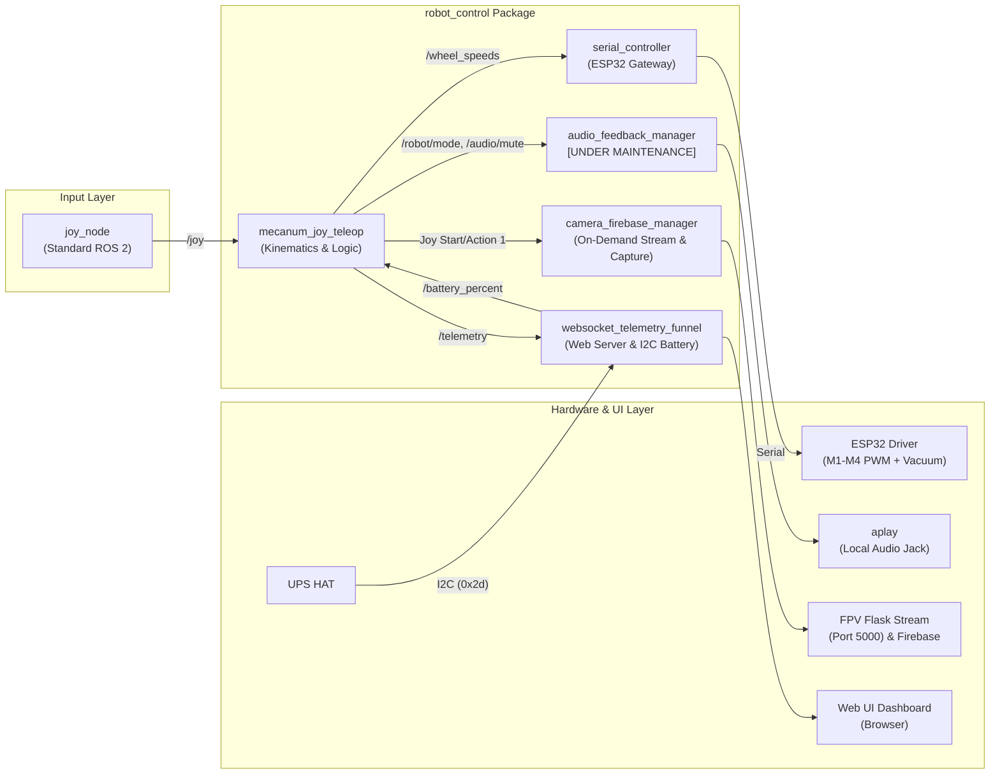
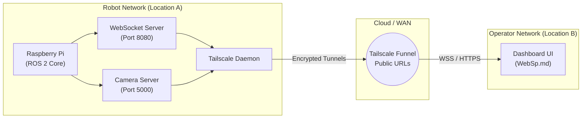

# 🤖 Teleoperated Waste Collection Robot (Stable V1)

[](https://docs.ros.org/)
[](#)
[](#)
[](#)

A modular, distributed robotics software stack for a 4-wheel Mecanum waste collection robot. Built on **ROS 2**, the current **Stable V1** iteration focuses on reliable teleoperation with real-time kinematics calculation, hardware safety isolation, low-latency telemetry streaming, advanced FPV Camera HUD, and remote dashboard monitoring via Tailscale mesh networking. The software architecture is explicitly designed to seamlessly integrate autonomous navigation in future updates.

---

## 📌 1. System Architecture Overview

The system follows a distributed compute model, decoupling high-level compute and networking (Raspberry Pi) from real-time motor actuation (ESP32):

```text
+-----------------------------------------------------------------------------------+
|                                  USER / OPERATOR                                  |
|         [ Game Controller ]                     [ Web Dashboard (WebSp) ]         |
+------------------+------------------------------------------+---------------------+
                   |                                          ^
                   | (Bluetooth / USB)                        | (WebSocket / HTTPS)
                   V                                          |
+-------------------------------------------------------------+---------------------+
|                      RASPBERRY PI (ROS 2 Compute Brain)                           |
|                                                                                   |
|   [/joy] ----> [ mecanum_joy_teleop ] ----> [/wheel_speeds]                       |
|                       |                             |                             |
|                       | (kinematics.py)             v                             |
|                       |                     [ serial_controller ]                 |
|                       v                             |                             |
|             [ audio_feedback_manager ]              | (USB Serial / 115200 Baud)  |
|                       |                             v                             |
|                       | (aplay *.wav)     +-----------------------------------+   |
|                       v                   |             ESP32                 |   |
|                 [ Speaker ]               | (PWM Actuation & Vacuum Relay)    |   |
+-------------------------------------------+-----------------+-----------------+---+
                                                              |
                                                              V
                                              [ Motor Drivers & Actuators ]
```

---

## 🔄 2. ROS 2 Computational Graph & Data Flow


```mermaid
flowchart LR
    subgraph Inputs ["Input Layer"]
        JoyNode["joy_node\n(Standard ROS 2)"]
    end

    subgraph Core ["robot_control Package"]
        Teleop["mecanum_joy_teleop\n(Kinematics & Logic)"]
        SerialNode["serial_controller\n(ESP32 Gateway)"]
        CameraNode["camera_firebase_manager\n(On-Demand Stream & Capture)"]
        AudioNode["audio_feedback_manager\n[UNDER MAINTENANCE]"]
        TelemetryNode["websocket_telemetry_funnel\n(Web Server & I2C Battery)"]
    end

    subgraph Outputs ["Hardware & UI Layer"]
        ESP32["ESP32 Driver\n(M1-M4 PWM + Vacuum)"]
        AudioOut["aplay\n(Local Audio Jack)"]
        CameraOut["FPV Flask Stream\n(Port 5000) & Firebase"]
        Dashboard["Web UI Dashboard\n(Browser)"]
        UPS["UPS HAT\n(I2C)"]
    end

    JoyNode -->|/joy| Teleop
    Teleop -->|/wheel_speeds| SerialNode
    Teleop -->|/robot/mode, /audio/mute| AudioNode
    Teleop -->|/telemetry| TelemetryNode
    Teleop -->|Joy Start/Action 1| CameraNode
    
    UPS["UPS HAT"] -->|"I2C (0x2d)"| TelemetryNode
    TelemetryNode -->|/battery_percent| Teleop

    SerialNode -->|Serial <M1,M2,M3,M4,Vacuum,Yaw,Pitch>| ESP32
    AudioNode --> AudioOut
    CameraNode --> CameraOut
    TelemetryNode --> Dashboard
```

---

## 🌐 3. Networking & Remote Telemetry (Tailscale Integration)

One of the core challenges in this project was enabling remote teleoperation and dashboard monitoring across different physical locations and ISPs without modifying router port-forwarding rules. To solve this, the system integrates **Tailscale** for secure overlay networking:

* **Tailscale Mesh VPN:** Connects the Raspberry Pi and the operator's PC into the same secure private network, regardless of their physical locations.
* **Tailscale Funnel:** Used to securely expose both the WebSocket server (`websocket_telemetry_funnel.py`) and the Flask FPV Camera stream to the public internet without exposing the whole device.


```mermaid
flowchart LR
    subgraph Robot_Environment ["Robot Network (Location A)"]
        Pi["Raspberry Pi\n(ROS 2 Core)"]
        WSS["WebSocket Server\n(Port 8080)"]
        Flask["Camera Server\n(Port 5000)"]
        TailscaleClient["Tailscale Daemon"]
        
        Pi --> WSS
        Pi --> Flask
        WSS --> TailscaleClient
        Flask --> TailscaleClient
    end

    subgraph Internet ["Cloud / WAN"]
        Funnel((Tailscale Funnel\nPublic URLs))
    end

    subgraph User_Environment ["Operator Network (Location B)"]
        Browser["Dashboard UI\n(WebSp.md)"]
    end

    TailscaleClient -->|Encrypted Tunnels| Funnel
    Funnel -->|WSS / HTTPS| Browser
```

---

## 🧠 4. Core Software Nodes & Features (Stable V1)

| Node / File | Primary Responsibility |
|---|---|
| **`mecanum_joy_teleop.py`** | Central command node. Ingests raw `/joy` inputs, performs deadzone filtering, executes 4-wheel **Inverse Kinematics**, manages PTZ Camera angles, displays a CLI dashboard, and publishes `/wheel_speeds`. |
| **`serial_controller.py`** | High-speed, robust serial gateway to ESP32. Formats wheel commands into delimited ASCII packets (`<M1,M2,M3,M4,Vacuum,Yaw,Pitch>`) and controls the Vacuum Relay. |
| **`camera_firebase_manager.py`** | Native Python camera state manager. Provides an **On-Demand Local MJPEG FPV Stream** (Flask on Port 5000) using `rpicam-vid` with Hardware ISP Flipping and a **Modern OpenCV HUD Overlay** (Parking Guidelines, Crosshair, Telemetry). Handles high-res image capture, resource locking, Base64 compression, and **Firebase RTDB uploads**. |
| **`websocket_telemetry_funnel.py`** | Real-time monitoring server **and hardware monitor**. Broadcasts system status, motor speeds, and reads **UPS HAT battery via I2C (`smbus`)**. It feeds data to the Web UI via WebSockets (Tailscale Funnel) and publishes `/battery_percent` back to the CLI dashboard. |
| **`audio_feedback_manager.py`** | **[CURRENTLY UNDER MAINTENANCE]** Headless status notifier. Uses `aplay` to play auditory cues for state transitions. |
| **`robot_core.launch.py`** | Automated orchestration. Brings up all core nodes, parameter configurations, and serial connections in a single command. |

---

## 💡 5. Engineering Decisions & Rationale

1. **Hardware ISP Image Flipping:**
   * In V1, we offload 180-degree image flipping to the `rpicam` Hardware Image Signal Processor. This completely removes CPU overhead for flipping frames while ensuring both the FPV Stream and the High-Res Photo Captures are perfectly oriented.
2. **OpenCV FPV Overlay (HUD):**
   * Real-time OpenCV drawings were added to provide an immersive operator experience. The FPV stream includes 0-60cm parking guidelines for tight navigation, a sniper-style crosshair, a black header bar indicating Pan/Tilt angles, and a flashing "PHOTO CAPTURED" notification.
3. **Decoupled ESP32 Serial Actuation:**
   * Linux on a Raspberry Pi is a Non-Real-Time OS. Offloading PWM signal generation and Relay triggering to the ESP32 ensures zero jitter on high-power motor drivers, maintaining smooth locomotion.
4. **On-Demand Camera Resource Management:**
   * FPV streaming drains bandwidth and battery. The camera system defaults to OFF. Using a gamepad toggle, it temporarily spawns an MJPEG Flask server via `rpicam-vid`. When a high-res photo is requested, the stream gracefully yields the hardware lock to `rpicam-still`, pushes to Firebase RTDB via Base64 string, and automatically resumes.

---

## 🚀 6. Future Roadmap
* **Vision & Object Detection (OCR):** Integrating OpenCV into the camera manager pipeline to read meter numbers before Firebase upload (Semester 2).
* **Full Autonomous Mode:** Developing the logic to transition from human-controlled `/joy` input to AI-driven navigation based on detected waste.
* **Closed-Loop Speed Control:** Adding PID velocity control using quadrature encoders on the ESP32.

---

## 📁 7. Repository Structure

```text
ros2_ws/
├── src/
│   └── robot_control/
│       ├── launch/
│       │   └── robot_core.launch.py       # Starts core nodes (joy, teleop, audio)
│       ├── media/                         # Audio assets for system feedback (*.wav)
│       ├── UPS_HAT_E/                     # UPS Battery hardware scripts & utilities
│       ├── robot_control/                 # Python module source
│       │   ├── audio_feedback_manager.py  # [MAINTENANCE] Event-based audio playback node
│       │   ├── camera_firebase_manager.py # Flask FPV Stream & Firebase Integration
│       │   ├── mecanum_joy_teleop.py      # Core teleoperation & CLI Dashboard
│       │   ├── serial_controller.py       # USB-Serial ESP32 communication gateway
│       │   ├── websocket_telemetry_funnel.py # Tailscale Funnel WS & I2C Battery node
│       │   └── WebSp.md                   # Web dashboard UI source code
│       ├── package.xml                    # Package dependencies & metadata
│       └── setup.py                       # Console script entry points
```

---

## ⚙️ 8. Quick Start & Launch

### Prerequisites
* ROS 2 (Humble/Iron/Jazzy)
* Python 3.10+
* `alsa-utils` (for `aplay`)
* `python3-smbus` (for I2C Battery Monitoring)
* `opencv-python-headless` (for FPV HUD Overlay)
* Tailscale (for remote telemetry)

### Build & Run
```bash
# Clone and build workspace
cd ~/ros2_ws
colcon build --symlink-install --packages-select robot_control
source install/setup.bash

# Launch full stack (Terminal 1)
ros2 launch robot_control robot_core.launch.py

# Launch Web Telemetry Server (Terminal 2)
ros2 run robot_control websocket_telemetry_funnel
```

### 🌐 Accessing the Dashboard & Camera

Once the system is running, you can monitor the robot remotely:

**1. Telemetry Web Dashboard (Hosted on Netlify)**
* Access the main control interface here: **[🔗 Refuse Robot - Netlify](https://refuserobot.netlify.app/)**
* **Local Network:** Dashboard WebSocket connects to `ws://<RASPBERRY_PI_IP>:8080`
* **Public Internet (Tailscale Funnel):** Dashboard connects securely via `wss://core.tailb47df1.ts.net:443` (Maps to 8080 locally).

**2. FPV Camera Live Stream**
* The stream defaults to **OFF** to save bandwidth and battery. 
* Press the **Start** button on your gamepad to toggle the stream **ON**.
* The stream features an advanced **OpenCV HUD Overlay** (Parking Guidelines, Crosshair, and Real-time Servo Angles).
* **Local Network:** `http://<RASPBERRY_PI_IP>:5000`
* **Public Internet (Tailscale Funnel):** `https://core.tailb47df1.ts.net:8443` (Maps to 5000 locally).
